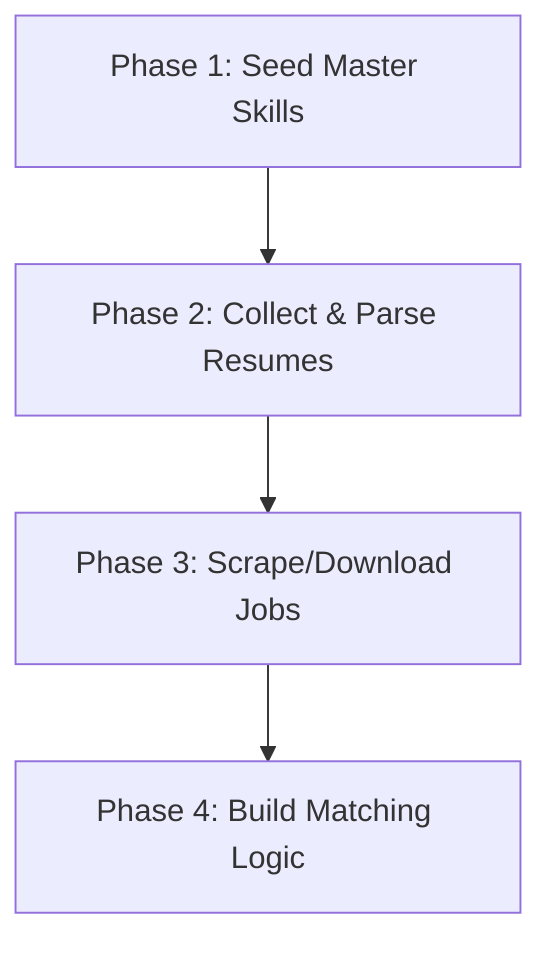

# CareerLensAI: Data Collection Guide

This guide outlines how and where to collect the raw data needed to power each step of the **CareerLensAI** pipeline (Resume Parsing, Skill Extraction, ATS Scoring, Job Matching, Skill Gap Analysis, Market Insights, and Learning Roadmaps).

---

## 1. Resume Data (For Resume Parsing & Skill Extraction)
To build and test your resume parser, you need a diverse set of PDF and Word (.docx) resumes.

### Free & Open Sources
*   **Kaggle Resume Datasets (Recommended):**
    *   [Resume Dataset by Gaurav Dutta](https://www.kaggle.com/datasets/gauravduttakiit/resume-dataset): Contains over 2,400 resumes categorized by job role (Data Science, Web Designing, Java Developer, etc.) in raw text format.
    *   [Resume Dataset for Parser](https://www.kaggle.com/datasets/snehaanbhawal/resume-dataset): A collection of resumes in PDF/Word format.
*   **Synthetic Resumes (Python generation):**
    *   You can generate test resumes programmatically using Python libraries like `Faker` and `python-docx` or `reportlab` to write mock resumes containing specific skills.
*   **GitHub Repositories:**
    *   Search GitHub for "resume dataset" or "CV dataset" to find crowdsourced resumes from job seekers.

---

## 2. Job Descriptions (For Job Matching & Skill Gaps)
To match candidates, you need a database of current job listings for Data Analysts, BI Analysts, Data Scientists, and Machine Learning Engineers.

### Free & Open Sources
*   **Kaggle Job Datasets:**
    *   [LinkedIn Job Postings (2023-2024)](https://www.kaggle.com/datasets/arshkon/linkedin-job-postings): Over 30,000+ job listings with titles, descriptions, skills, and salaries.
    *   [Glassdoor Job Reviews & Descriptions](https://www.kaggle.com/datasets/thedevastator/uncover-the-best-jobs-glassdoor-job-postings): Good for general tech jobs.
*   **Free APIs:**
    *   **Adzuna API:** Provides free search access to active job listings across the world with clean JSON responses.
    *   **SerpAPI (Google Jobs API):** A wrapper around Google Jobs searches. The free tier gives you 100 searches per month.
*   **Web Scraping (DIY):**
    *   Using Python with `BeautifulSoup` or `Playwright`/`Selenium` to scrape job boards like Indeed, Glassdoor, or LinkedIn (ensure you respect their `robots.txt` and terms of service).

---

## 3. Skills Taxonomy (For Skill Extraction & Standardization)
You need a standard dictionary of skills to match a resume skill (e.g., "sklearn") with a job skill (e.g., "Scikit-Learn").

### Free & Open Sources
*   **ESCO (European Skills, Competences, Qualifications and Occupations):**
    *   [ESCO Dataset](https://esco.ec.europa.eu/en/use-esco/download): Completely free, open-source taxonomy containing over 13,000 skills mapped across different occupations. You can download it as a CSV/RDF file.
*   **O*NET Database (US Department of Labor):**
    *   [O*NET Web Services](https://www.onetcenter.org/): A highly detailed classification of occupations, skills, and knowledge domains. You can download their database files.
*   **Lightcast Open Skills API (formerly Emsi):**
    *   [Lightcast Open Skills](https://lightcast.io/open-skills): Offers a free API to search over 30,000 skills. Excellent for identifying spelling variants and related tech skills.

---

## 4. Market Insights (For Salaries & Demand Trends)
To tell candidates about market demand, salary ranges, and hiring hot spots.

### Free & Open Sources
*   **Stack Overflow Developer Survey:**
    *   [Stack Overflow Raw Data](https://insights.stackoverflow.com/survey): Download CSVs of their annual surveys containing direct answers from 80,000+ developers about their roles, salaries, and tech stacks.
*   **Bureau of Labor Statistics (BLS) API (US-focused):**
    *   [BLS Developer Site](https://www.bls.gov/developers/): Free API to pull occupational employment and wage statistics.
*   **Kaggle Salaries Datasets:**
    *   [Data Science Salaries Dataset](https://www.kaggle.com/datasets/ruchi798/data-science-job-salaries): Tracks yearly trends for AI/ML/Data analyst salary brackets globally.

---

## 5. Learning Roadmaps (For Skill Gap Recommendations)
Once you find a skill gap (e.g., candidate doesn't know SQL), you need resources to recommend.

### Free & Open Sources
*   **roadmap.sh (Open Source):**
    *   [roadmap.sh GitHub](https://github.com/kamranahmedse/developer-roadmap): The standard for developer career maps. You can reference or parse their guides to build structured learning suggestions.
*   **Online Course Catalog APIs:**
    *   **Coursera Partner API / Catalog:** Check Coursera’s public feeds for course listings, titles, and URLs.
    *   **Udemy Affiliate/Search API:** Pull course lists, reviews, and URLs for specific keywords.
    *   **YouTube Search API:** Set up search queries for courses (e.g., "SQL tutorial for beginners") and store highly-rated playlists in your database.

---

## 6. Recommended Action Plan: What to do next?

### Step 1: Initialize the Master Skills Library
Download a list of tech skills and load them into your `skills` table.
*   *Fast Track:* Use a curated list of ~100 common data science, software engineering, and analytical skills to start testing.
*   *Production:* Download the ESCO Skills CSV and write a script to import technical skills into your database.

### Step 2: Set Up Mock Candidates and Jobs
Use the `seed.sql` script we created to start building your backend parser and logic.

### Step 3: Implement the Resume Parser
Write a Python script using:
*   `pypdf` or `pdfplumber` to extract text from resumes.
*   An NLP library like `spaCy` or regex/keyword matching to scan the extracted text for skills present in your `skills` table.

### Step 4: Fetch Job Descriptions
Download a Kaggle Job Posting CSV dataset and write a script to insert 50-100 analytics jobs into your `jobs` table.
